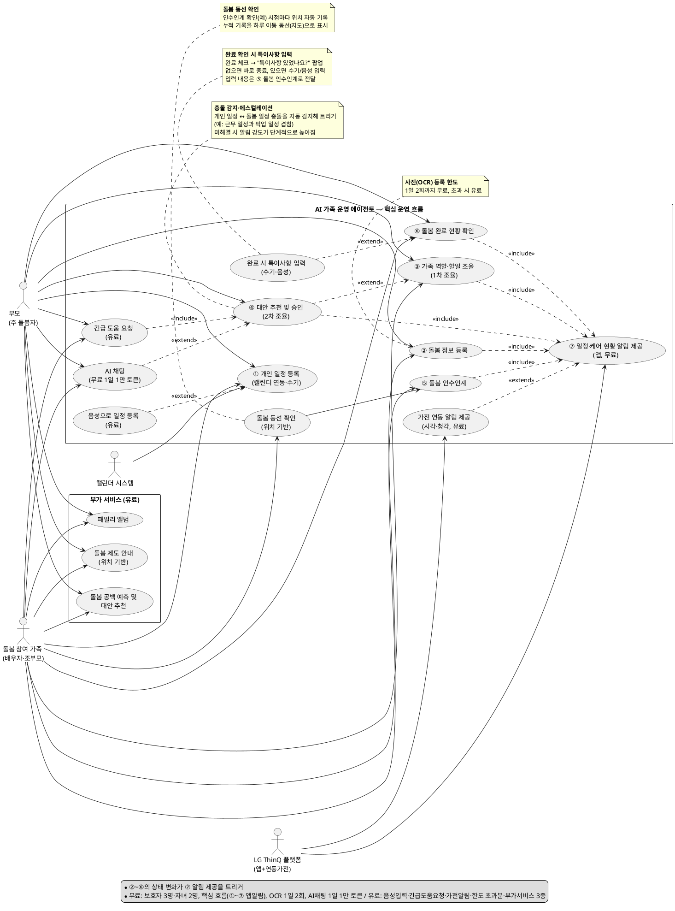

# AI 가족 운영 에이전트 — 유스케이스 다이어그램

> 본 문서는 `PRD_MVP_AI가족운영에이전트.md`(PRD·MVP 기획서)의 내용을 근거로 작성되었습니다.
> 유스케이스 다이어그램의 목적("시스템과 사용자가 전체적으로 어떻게 상호작용하는지 보여주는 것")에 맞춰, 세부 입력 동작(사진 촬영, 텍스트 파싱 등)은 제외하고 **핵심 상호작용 단위**로만 구성했습니다.
>
> `참고앱.pdf`(Kid Pickup) 검토 결과를 일부 반영했으며(충돌 자동 감지, 알림 에스컬레이션, 자연어 질의, 사진 체크인, 긴급 도움 요청), 이후 사용자 피드백에 따라 **① 완료 체크 시 특이사항 입력 팝업, ② 인수인계 시점 위치 기록 기반 돌봄 동선 확인, ③ 예외 상황 트리거 구조 명확화(자동 감지 vs 사용자 주도 요청), ④ 무료·유료 기능 구분, ⑤ 부가 기능 3종(돌봄 공백 예측·패밀리 앨범·돌봄 제도 안내)**을 추가로 반영했습니다.

---

## 1. 액터(Actor) 정의

| 구분 | 액터 | 설명 |
|---|---|---|
| 주요 액터 (Primary) | **부모 (주 돌봄자)** | 개인 일정·돌봄 정보를 등록하고, 가족 역할 조율·예외 승인·완료 현황을 확인하는 서비스의 핵심 사용자 |
| 주요 액터 (Primary) | **돌봄 참여 가족** (배우자 · 조부모) | 돌봄 정보를 함께 등록하고, 역할 조율에 참여하며, 돌봄 인수인계를 주고받는 사용자 |
| 외부 시스템 액터 | **LG ThinQ 플랫폼** (앱 + 연동 가전) | 일정·케어 현황 알림 채널. **앱 알림은 기본(무료)**, **연동 가전(TV·정수기·로봇청소기 등)을 통한 시각·청각 알림은 유료** |
| 외부 시스템 액터 | **캘린더 시스템** | 등록된 개인 일정을 동기화하는 외부/내장 캘린더 연동 시스템 |

---

## 2. 전체 흐름 (7단계) 및 관련 액터

| 단계 | 유스케이스 | 설명 | 관련 액터 |
|---|---|---|---|
| 1 | **개인 일정 등록** | 캘린더와 연동해 개인 일정을 수기로 등록(무료) — 음성 등록은 유료 확장 | 부모, 돌봄 참여 가족, 캘린더 시스템 |
| 2 | **돌봄 정보 등록** | 자녀·가족 돌봄 관련 정보(등하원, 준비물 등)를 등록 | 부모, 돌봄 참여 가족 |
| 3 | **가족 역할·할일 조율 (1차)** | 등록된 일정·돌봄 정보를 근거로 가족 간 역할과 할 일을 1차로 배정·조율 | 부모, 돌봄 참여 가족 |
| 4 | **예외 상황 대안 추천 및 승인 (2차 조율)** | ① 시스템이 일정 충돌을 자동 감지해 먼저 알리거나(무료), ② 사용자가 직접 긴급 도움을 요청(유료)하면 — 이후 동일한 대안 추천·승인 절차로 진행. 미응답 시 알림이 단계적으로 강해지며, AI에게 직접 질의도 가능(무료 1일 10,000 토큰) | 부모, 돌봄 참여 가족 |
| 5 | **돌봄 인수인계** | 돌봄 주체가 바뀔 때 필요한 맥락 정보를 전달. **인수인계 확인 시점의 위치가 자동 기록**되어 하루 돌봄 동선으로 확인 가능 | 돌봄 참여 가족 |
| 6 | **돌봄 완료 현황 확인** | 배정된 역할·할 일의 완료 여부를 확인. **완료 체크 시 특이사항 유무를 팝업으로 확인**하며, 있으면 수기/음성으로 입력해 인수인계(5단계)에 반영 | 부모, 돌봄 참여 가족 |
| 7 | **일정·케어 현황 알림 제공** | **앱 알림(기본/무료)** 또는 **연동 가전(TV=시각, 정수기·로봇청소기 등=청각, 유료)**으로 알림 제공 | LG ThinQ 플랫폼 |

---

## 3. 확장 유스케이스 (extend / include)

| 유스케이스 | 관계 | 기준 유스케이스 | 가격 정책 | 설명 |
|---|---|---|---|---|
| 음성으로 일정 등록 | `<<extend>>` | ① 개인 일정 등록 | 유료 | 음성으로 개인 일정을 등록(예: "나 오늘 몇 시에 회의 잡혔어") |
| AI 채팅 | `<<extend>>` | ④ 대안 추천 및 승인 | 무료(1일 10,000 토큰) → 초과 시 유료 | 가족이 능동적으로 AI에게 자연어로 질의. 메시지 "횟수"가 아닌 "토큰" 소모량 기준(매일 자정 초기화) |
| 긴급 도움 요청 | `<<include>>` | ④ 대안 추천 및 승인 | 유료 | 사용자가 직접 도움을 요청하면 **반드시** 대안 추천·승인 절차가 함께 실행됨(조건부 아님) |
| 완료 시 특이사항 입력 | `<<extend>>` | ⑥ 돌봄 완료 현황 확인 | 무료 | 완료 체크 후 "특이사항이 있었습니까?" 팝업 → "있음" 선택 시에만 수기/음성으로 입력. 입력 내용은 ⑤ 돌봄 인수인계에 반영 |
| 돌봄 동선 확인 | 연관(association) | ⑤ 돌봄 인수인계 | 무료 | 인수인계 확인("예") 시점마다 자동 기록되는 위치 정보를 모아 하루 이동 동선을 지도로 확인 |
| 가전 연동 알림 제공 | `<<extend>>` | ⑦ 알림 제공 | 유료 | TV(시각), 정수기·로봇청소기 등(청각) 연동 가전을 통한 알림 |

---

## 4. 부가 서비스 (유료 전용, 7단계 흐름과 별개)

| 유스케이스 | 설명 | 액터 |
|---|---|---|
| 돌봄 공백 예측 및 대안 추천 | 방학 등 예정된 돌봄 공백을 D-day로 미리 안내하고, 수영·피아노·태권도 등 대체 프로그램을 추천 | 부모, 돌봄 참여 가족 |
| 패밀리 앨범 | 자녀 사진을 가족 구성원이 함께 올리고 공유해 보는 공용 앨범 | 부모, 돌봄 참여 가족 |
| 돌봄 제도 안내 | 위치 기반으로 조부모 돌봄수당·늘봄교실·돌봄교실 등 지자체 돌봄 지원 사업을 미리 안내 | 부모, 돌봄 참여 가족 |

---

## 5. 무료·유료 정책 요약

| 구분 | 범위 |
|---|---|
| **무료** | 보호자(주보호자+돌봄 참여 가족) 최대 3명, 자녀 최대 2명 / 핵심 4대 기능(①~⑦ 기본 흐름) / ThinQ 앱 알림 / 사진(OCR) 등록 1일 2회 / AI 채팅 1일 10,000 토큰 |
| **유료** | 긴급 도움 요청, 돌봄 공백 예측, 패밀리 앨범, 돌봄 제도 안내, 가전 연동 알림(시각·청각), 음성 입력(일정 등록·긴급 요청), 사진(OCR) 등록 1일 2회 초과분, AI 채팅 1일 10,000 토큰 초과분 |

> 사진(OCR) 등록 1일 2회, AI 채팅 1일 10,000 토큰(입력+출력 합산, 매일 자정 초기화)은 사용자 요청에 따라 기획서 작성자가 설정한 초기 기준값입니다. 메시지 "횟수"가 아니라 "토큰 소모량" 기준으로 설계해 대화량이 많은 사용자와 적은 사용자를 공정하게 구분합니다. 운영 데이터를 바탕으로 조정될 수 있습니다.

---

## 6. 설계 메모
- **1차 조율 → 2차 조율 구조**: `가족 역할·할일 조율(1차)`이 기본 흐름이며, 예외 상황이 발생했을 때만 `대안 추천 및 승인(2차 조율)`이 작동하도록 `<<extend>>` 관계로 표현했습니다.
- **2차 조율의 두 가지 트리거**: ① 시스템이 이미 등록된 가족 일정들 간 충돌을 자동 감지해 먼저 알리는 경로(무료)와 ② 사용자가 자신의 일정 변경을 인지하고 직접 긴급 도움을 요청하는 경로(유료, `<<include>>`)로 나뉘며, **진입 경로만 다를 뿐 이후 대안 추천·승인·배정 갱신 절차는 동일**합니다.
- **AI 채팅**은 2차 조율의 선택적 확장(`<<extend>>`)이며, 무료 티어는 1일 10,000 토큰(메시지 "횟수"가 아닌 "토큰" 소모량 기준, Claude 등 생성형 AI 서비스의 사용량 기반 과금 방식 참고)으로 제한하고 매일 자정 초기화되며, 초과 시 유료 전환됩니다.
- **사진(OCR) 등록**도 동일한 원리로 1일 2회까지 무료이며 초과분은 유료입니다(② 돌봄 정보 등록 내 입력 방식 중 하나).
- **완료 확인 → 특이사항 → 인수인계 연결**: 담당자가 완료를 체크하면 특이사항 유무를 묻는 팝업이 항상 뜨고(⑥의 기본 흐름), "있음"을 선택했을 때만 수기/음성 입력 화면이 노출되는 조건부 동작이므로 `<<extend>>`로 표현했습니다. 입력된 내용은 다음 담당자의 인수인계(⑤) 정보로 전달됩니다.
- **돌봄 동선 확인**: 별도 입력 없이 ⑤ 돌봄 인수인계가 확인될 때마다 위치가 자동 기록되는 부산물 데이터이므로, 독립 유스케이스로 분리하되 ⑤와 연관 관계로 표현했습니다.
- **알림 제공의 무료/유료 분리**: 기존에는 앱 알림과 가전 알림을 하나의 유스케이스로 통합했으나, 가전 알림이 유료화되면서 `일정·케어 현황 알림 제공(⑦, 앱=무료)`과 `가전 연동 알림 제공(유료, <<extend>>)`으로 분리했습니다.
- **부가 서비스 3종**은 7단계 핵심 운영 흐름과 직접적인 순서 종속성이 없는 독립 기능이므로 별도 패키지로 분리했습니다.
- **알림 제공**은 돌봄 정보 등록·역할 조율(1차/2차)·인수인계·완료 확인 5개 유스케이스에서 공통으로 발생하므로 `<<include>>` 관계로 연결했습니다.
- 참고앱의 이웃·베이비시터 등 가족 외부 도우미 확장, 범용 인앱 채팅은 우리 타겟·차별화 포인트와 맞지 않아 반영하지 않았습니다.

---

## 7. PlantUML 코드

